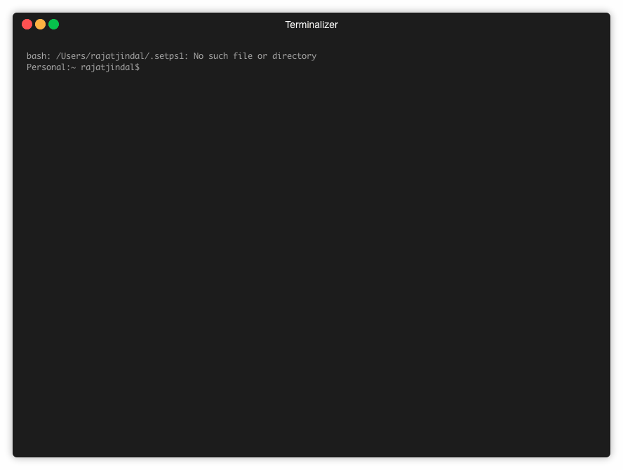

# kubectl-modify-secret

`kubectl-modify-secret` is a [kubectl plugin](https://kubernetes.io/docs/tasks/extend-kubectl/kubectl-plugins/) that allows user to modify the secret without having to worry about doing base64 encoding/decoding.

This plugin pulls the secret from Kubernetes, and open the configured editor with just the decoded secret data. Once user makes changes, save and quit the editor, the plugin automatically apply the updated data to Kubernetes.


# Installing
- install `krew` using instructions [here](https://github.com/kubernetes-sigs/krew#installation)
- run `kubectl krew update`
- run `kubectl krew install modify-secret`




# Usage

- use namespace and kubeconfig from $KUBECONFIG current context

```bash
    kubectl modify-secret xyz
```

- provide namespace explicitly

```bash
    kubectl modify-secret xyz -n kube-system
```

- use different kubeconfig file

```bash
    kubectl modify-secret xyz --kubeconfig /path/to/different/kube/config
```